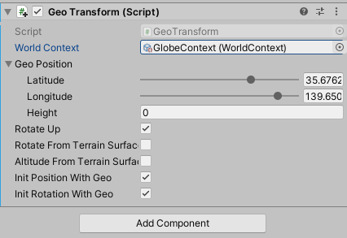
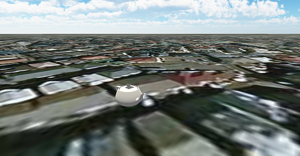

# Documentation

## Core Concepts
To get started with the One World SDK for Unity, at least two concepts need to be addressed:

1. Floating Origin
2. Terrain Tiles

## Floating Origin
In Unity, conventionally 3D coordinates are expressed as single-precision floating point (float) units representing meters. Due to the size of the areas being represented in the owsdk, usage of float is insufficient to express object coordinates, and leads to "jitter" of mesh vertices, incorrect collision results, and other oddities.

In order to have the ability to accurately represent the entire globe, the OWSDK instead represents 3D coordinates as double-precision (double) values. In order to convert to 'Unity' coordinates, a relative origin system is used. This is represented by the IRTOcontext (Relative-To-Origin). This interface represents a floating origin for object coordinates to be calculated from.

## IRTOContext
The IRTOContext simply consists of a Vector3d WorldOrigin, designating the position to which points are relative to, and an event WorldOriginChanged to alert when this point is changed.

The WorldOrigin to be a position close to an area of interest, such as the game's camera.

*Note: Care should be taken to not invoke the WorldOriginChanged event too frequently, as often this will cause listeners to re-calculate and move their position in response.*

## Calculating To and From Unity Coordinates
To translate between OWSDK Vector3d to Unity Vector3:

```
Vector3d worldPos;
IRTOContext rtoContext;

//...

Vector3 unityPos = (worldPos - rtoContext.WorldOrigin).ToVector3();
```

## Translating from OWSDK Vector3d position to Unity Vector3 position

To translate between Unity Vector3 and OWSDK Vector3d:

```
Vector3 unityPos;
IRTOContext rtoContext;

//...

Vector3d worldPos = unityPos.ToVector3d() + rtoContext.WorldOrigin;
```

## Terrain Tiles
The OWSDK has the ability to dynamically render globe terrain at various levels of detail by use of a tiling system. The functionality of selecting which tiles are active, and their levels of detail is provided by creating an instance of TerrainTileChunker.

## Terrain Tiles and TerrainTileIndex
The basic concept of a TerrainTileIndex is based on a simple tile system:

Each tile is identified by three integers: row, column, and lod.
Each tile has four children, which represent the top-left, top-right, bottom-left, and bottom-right of the tile at the next level of detail.
Levels of detail start at 1 and go as high as necessary to represent the area of interest. Additionally, each tile is further divided into pixels. Within the same LOD, every tile has the same Pixel Width, and Pixel Height. The exact width and height are given by a ITileMapper.

## ITileMapper
The interface ITileMapper maps terrain tile indices and pixels into Geodetic coordinates. The ITileMapper can be used to "shape" tiles to a specific projection system in order to natively support rasterizing data.

For most usages, the WMSTileMapper is used, in which tiles are laid out using the same tiling system used by Bing, Google Maps, and OpenStreetmap.

## TerrainTileChunker
The TerrainTileChunker is the class responsible for controlling which terrain tiles are considered active, and their resolution. It controls spawning and placing terrain geometry within the Unity scene.

## Configuration
The TerrainTileChunker is primarily provided with:

A camera - Used to calculate level-of-detail  
A ITerrainTileProvider - Used to display imagery on the tiles  
A ITileMapper - Used to calculate terrain tile resolution and bounds  
A ITileMeshProvider - Used to generate terrain meshes  

Additionally it contains quality settings:

## MaxNumTiles
The number of tiles to keep in in-memory cache.

## PreloadPercent
The percentage of MaxNumTiles to load during the PreLoad stage.

## DisablePhysics
If true, terrain tiles will contain no colliders.

## MaxConcurrentload
The maximum number of tiles to load concurrently.

## MaxTileLOD
The highest LOD to load. Inclusive.

## MaxPhysicsLOD
The highest LOD to use for Physics purposes.

## LoadFrameBudget
A "budget" to constrain time spent updating tiles each frame, in milliseconds. The chunker may regularly exceed this budget depending on load.

## AtlasTileSize
The size, in tiles, of each texture atlas used by the tiles.

The TerrainTileChunker makes use of texture atlases to reduce the number of SetPass calls during the Unity rendering phase.


## Object Placement
The section on floating origin is required reading.

There are various ways to position an object in the OWSDK.

### Geocentric Coordinates
If you have the Geocentric coordinates of an object you wish to place in the world, then placing it is a matter of calculating its Unity position using the WorldOrigin of the IRTOContext. For stationary objects, the MonoBehaviour GeocentricTransform may be used.

### WGS84 Coordinates
When using lat, lon, the process is the same, but additionally requires using the Ellipsoid in use to calculate the Geocentric position. A MonoBehaviour GeoTransform allows setting object position using Geodetic3d coordinates directly. Additionally, GeoTransform will calculate the appropriate Up orientation to establish a local-to-the-ground Up direction for the GameObject.




The settings for the GeoTransform MonoBehaviour are shown above. Don't forget to set the WorldContext on the GeoTransform!

To transform from a WGS84 coordinate (expressed as lat,lon,elevation):

```
Geodetic3d wgs84Pos;

Vector3d worldPos = ellipsoid.ToVector3d(wgs84Pos);
Vector3 unityPos = (worldPos - rtoContext.WorldOrigin).ToVector3();
```

Converting from a WGS84 coordinate to a Unity scene Vector3

And to transform from a Unity scene coordinate to WGS84:

```
Vector3 unityPos;

Vector3d worldPos = unityPos.ToVector3d() + rtoContext.WorldOrigin;
Geodetic3d wgs84Pos = ellipsoid.ToGeodetic3d(worldPos);
Converting from a Unity Vector3 position to a WGS84 position
```

## How to Load Elevation from a SQL Database
To configure elevation via an SQL database, add an object for `elevationProviderSettings.sql`:

``` json
  "elevationProviderType": "sql",
  "elevationProviderSettings": {
    "sql": {
      "databaseFile": "<PATH-TO-DATABASE-FILE>",
      "baseLOD": 13,
      "useDownsamples": true
    }
  }
```

**Note:** Querying elevations directly from a SQL file is a bit faster than from Bing, but setting up a local elevations database is required.


# Common Issues
## Rotating an Object To Face North
An extension method to Ellipsoid is available to calculate the "NED" (North East Down) rotation of an object as a Unity Quaternion:  
  
  
```
Transform unityTransform;
unityTransform.rotation = ellipsoid.NEDRotation(wgs84Coordinate);
```

## Building the Executable

When you build the game, you will need to make sure that the One World SDK Viewer is in a directory in which it can locate the config file. 

When the executable is run, it will look for the config file in the location "../../data/OneWorldSDK\_Viewer.config.json". 

So, for example, if you have your exe built here:

"<root>\build\OneWorldSDK\_Viewer\OneWorldSDK\_Viewer.exe"

the config file must be in the location:

"<root>\data\OneWorldSDK\_Viewer.config.json"

## Using a Controller to Move the Camera

We use Unity's [Input Manager](https://docs.unity3d.com/Manual/class-InputManager.html) to control the globe which makes it easy for you to make your own controls. It can be found by going to Edit -> Project Settings... The axis labled *Horizontal* is used for moving moving left and right (increasing or decreasing longitude). You can modify the Positive/Negative buttons. Similarly, the *UpDown* axis is used for decreasing/increasing altitude. The source code that manipulates camera movement is [src/OneWorldSDK_UnityDemo/Assets/UnityDemo/Scripts/WorldObjectMovement.cs](../src/OneWorldSDK_UnityDemo/Assets/UnityDemo/Scripts/WorldObjectMovement.cs).
